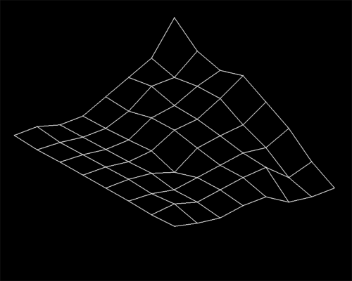

# Raise the terrain

<p align="center">
	
</p>

## Installation and Usage

This project was realised on **Ubuntu 20.04 LTS**, with **SDL 2.0.10** and compiled with **GCC 9.4.0**. Depending on the changes, it may not work on future version. If you want to download and test our project, follow these steps (The SDL2 installation step is only necessary if you don't have `SDL2` and `SDL2_ttf`):
```
$ git clone https://github.com/adut24/Raise_the_terrain.git && cd Raise_the_terrain
$ sudo apt install libsdl2-dev && sudo apt install libsdl2-ttf-dev
$ gcc *.c -o terrain `sdl2-config --cflags` `sdl2-config --libs` -lSDL2_ttf -lm
$ ./terrain z_axis
```

# Description
Raise the terrain is an optional project realised in Holberton School. The purpose is to learn how to use graphic library in C.

# Tasks

## 0. Basics
Draw the isometric projection of a grid. To draw a grid using isometric projection, you’ll need to convert 3D coordinates (coordinates in the real world) to 2D coordinates (coordinates on the screen), as follows:
```
WX = inclination * X - inclination * Y;
WY = (1 - inclination) * X + (1 - inclination) * Y - Z;
```
Where an inclination of 70% would have a value of 0.7 in this above equation. You can choose to incline your grid as much as you want.

### Requirements
* Usage: `terrain file`
* Draw a grid using an isometric projection
* The grid must be described in a file
* The color used to draw the grid doesn’t matter (same for the background)
* Your grid must be centered and takes as much space as possible on the screen. We should be able to see the whole screen.
* Your program should end when the user is pressing the `ESC` key

## 1. Rotation
* Rotate the grid when the user is using left or right arrows
* Please use the `M_PI` macro defined in `math.h`
* Link with the gcc `-m` flag to be able to use the math library

Here is the formula to apply a rotation to a point in 2D:
* The 2D point you want to rotate is defined with the coordinates [x, y].
* The rotation angle `a` is calculated as follow:
```
a = Angle * PI / 180
```
`Angle` being the angle in degrees, and `a` the angle in radians.
```
Rx = x * cos(a) - y * sin(a)
Ry = x * sin(a) + y * cos(a)
```
